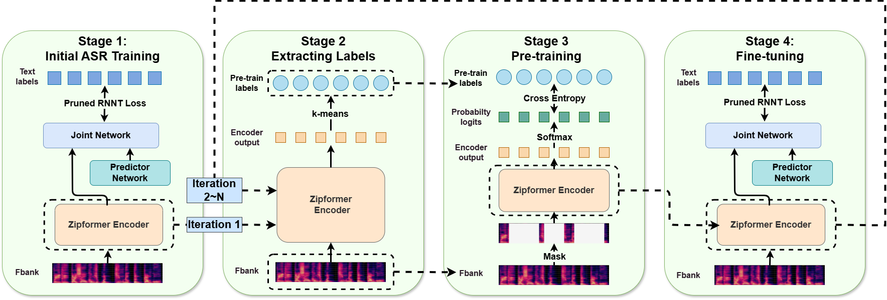

# VietASR: Achieving Industry-level Vietnamese ASR with 50-hour labeled data and Large-Scale Speech Pretraining
[](https://arxiv.org/abs/2505.21527)
[](https://github.com/zzasdf/VietASR)

This repository is the official code for [VietASR](https://arxiv.org/abs/2505.21527).

A model checkpoint trained on 70,000 hours of Vietnamese pseudo-labeled data, generated by VietASR Iteration 3, is available at [huggingface](https://huggingface.co/zzasdf/viet_iter3_pseudo_label).

## Overview
VietASR is a training pipeline designed for low resource ASR. It uses ASR-biased SSL to pretrain a strong speech encoder with limited labeled data and large-scale unlabeled data. The training pipeline of VietASR consists of 4 stages: initial ASR training, extracting labels, pretraining and finetuning.



## Environment
This repo relies on [lhotse](https://github.com/lhotse-speech/lhotse) for data pretreatment and uses [icefall](https://github.com/k2-fsa/icefall) as the framework. For the steps to install these two dependencies, please refer to [icefall install tutorial](https://k2-fsa.github.io/icefall/installation/index.html). Make sure to run the following command in your terminal before running any script in this repo. When you run this command, the icefall_path should be replaced with the path to your icefall repository.
 ```bash
 export PYTHONPATH=icefall_path:$PYTHONPATH
 ```
 
## Data preparation
### Unsupervised data preparation
We use [funASR](https://huggingface.co/funasr/fsmn-vad) to perform VAD for unsupervised data. Check [vad.py](SSL/local/vad.py) for an example script.

Then we extract fbank features from unsupervised audio segments. The segmented audio should be in `.wav` form, and stored under ```SSL/download/ssl_${subset_name}```. Please update the   ```subset_name``` in ```./SSL/prepare_ssl.sh``` to match your data organization. And then run the following command. Make sure that you have a subset called dev, and `subset_name` for every subset used for training should start with "train"
```bash
cd SSL
./prepare_ssl.sh
```
Once the execution is complete, a new directory will be created at ```SSL/data/ssl_${subset_name}/{subset_name}_split``` which stores the manifest of unsupervised data.
Check [SSL/prepare_ssl.sh](SSL/prepare_ssl.sh) for details.

### Supervised data preparation
Put your supervised data under ```download/supervised```. The audio should be in `.wav` form, and the data structure should be like
```
download
├───train
|   ├───data1
|   |   ├───*.wav
|   |   └───filename.trans.txt
|   └───...
├───test
|   └───...
└───dev
    └───...
```
The filename.trans.txt should contain the text label for the `.wav` file in the directory, like the following structure:
```
audio_filename_without_suffix_1 text_label_1
audio_filename_without_suffix_2 text_label_2
```
And then run
```bash
cd ASR
./prepare.sh
```

## Initial ASR model
The training process of VietASR starts from training an ASR model with a small amount of labeled data.
```bash
cd ASR
./scripts/train.sh
```

## Train k-means model
We will train the kmeans model on a small cut (about 100 hours, you can build it with the gzip library of python) of the unsupervised manifest. Set the ```--files``` in ```SSL/scripts/learn_fbank_kmeans.sh``` to the train cut path. For the first iteration of pretraining, the k-means is applied to the ASR model trained on supervised data, so you should set the ```--checkpoint-type``` to be ```ASR``` in the script, and ```finetune``` for other iterations. And then run

```bash
cd SSL
./scripts/learn_vietASR_kmeans.sh
```

Check [learn_vietASR_kmeans.sh](SSL/scripts/learn_vietASR_kmeans.sh) for details

## Extract labels
This part will extract k-means labels from source cuts and save them to the target cuts. Assume the source cuts paths and the target cuts paths are stored in a file (```--task-list``` in the script) in the following form:
```
src_cut_path1 target_cut_path1
src_cut_path2 target_cut_path2
...
```
src_cut_path is the path for unsupervised manifest, for example, ```data/ssl_data/data_split/vietASR-ssl_cuts_data.00000001.jsonl.gz```, and for target path, an extra label type is necessary to distinguish label of different iterations, so the `target_cut_path` should be like ```data/ssl_data/data_split/vietASR-ssl_cuts_data_iter1.00000001.jsonl.gz```

Modify ```SSL/scripts/extract_vietASR_kmeans.sh```, and then run
```bash
cd SSL
./scripts/extract_vietASR_kmeans.sh
```
Check [extract_vietASR_kmeans.sh](SSL/scripts/extract_vietASR_kmeans.sh) for details

## Pre-train
To run pretraining, update the parameters following the instructions in ```SSL/scripts/run_ssl.sh``` and run
```bash
cd SSL
./scripts/run_ssl.sh
```
## Fine-tune
To finetune the pretrained model, update the parameters following the instructions in ```SSL/scripts/finetune.sh``` and run
```bash
cd SSL
./scripts/finetune.sh
```
## Decode
To run evaluation, update the parameters following the instructions in ```SSL/scripts/decode.sh``` and run
```bash
cd SSL
./scripts/decode.sh $epoch $avg $gpu_id
```
Here, the arguments mean that the checkpoint of ```$epoch``` is evaluated, with a model average on ```$avg``` epoch, using the GPU ```$gpu_id```

## Citation
If you find our work or codebase useful, please cite it as follows:
```
@inproceedings{zhuo2025vietasr,
    title={{VietASR}: Achieving Industry-level Vietnamese {ASR} with 50-hour labeled data and Large-Scale Speech Pretraining}, 
    author={Jianheng Zhuo and Yifan Yang and Yiwen Shao and Yong Xu and Dong Yu and Kai Yu and Xie Chen},
    booktitle={Proc. Interspeech},
    year={2025},
    address={Rotterdam},
}

@inproceedings{yang2025k2ssl,
    title={{k2SSL}: A Faster and Better Framework for Self-Supervised Speech Representation Learning}, 
    author={Yifan Yang and Jianheng Zhuo and Zengrui Jin and Ziyang Ma and Xiaoyu Yang and Zengwei Yao and Liyong Guo and Wei Kang and Fangjun Kuang and Long Lin and Daniel Povey and Xie Chen},
    booktitle={Proc. ICME},
    year={2025},
    address={Nantes},
}
```

## License

This project is based on the [icefall](https://github.com/k2-fsa/icefall) framework and is licensed under the Apache License 2.0.  
You can find the full license text in the LICENSE file.
